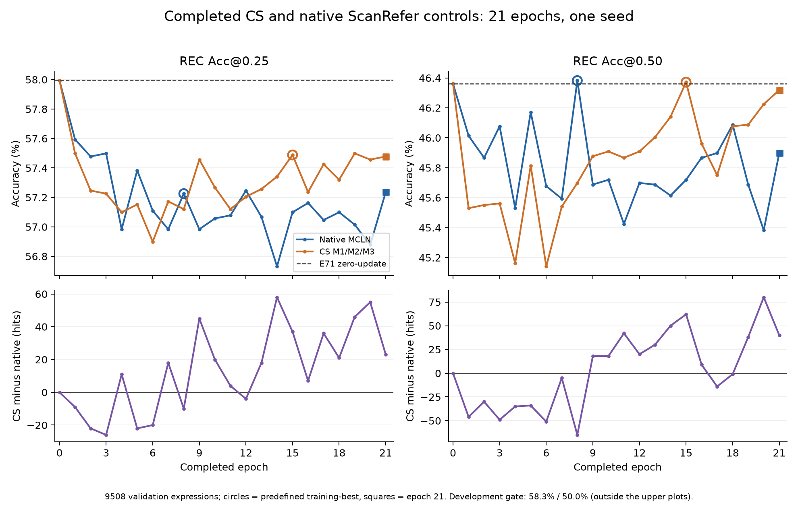

# Completed CS and native ScanRefer controls

Both runs use E71 initialization, seed2027, batch12, 21 epochs and full9508 native `last/bbs` validation. Epoch0 is excluded from saved training-best ranking.

| Epoch | Native hits @.25 / @.50 | CS hits @.25 / @.50 | CS minus native |
|---:|---:|---:|---:|
| 0 | 5514 / 4408 | 5514 / 4408 | +0 / +0 |
| 1 | 5476 / 4375 | 5467 / 4329 | -9 / -46 |
| 2 | 5465 / 4361 | 5443 / 4331 | -22 / -30 |
| 3 | 5467 / 4381 | 5441 / 4332 | -26 / -49 |
| 4 | 5418 / 4329 | 5429 / 4294 | +11 / -35 |
| 5 | 5456 / 4390 | 5434 / 4356 | -22 / -34 |
| 6 | 5430 / 4343 | 5410 / 4292 | -20 / -51 |
| 7 | 5418 / 4335 | 5436 / 4330 | +18 / -5 |
| 8 | 5441 / 4410 | 5431 / 4345 | -10 / -65 |
| 9 | 5418 / 4344 | 5463 / 4362 | +45 / +18 |
| 10 | 5425 / 4347 | 5445 / 4365 | +20 / +18 |
| 11 | 5427 / 4319 | 5431 / 4361 | +4 / +42 |
| 12 | 5443 / 4345 | 5439 / 4365 | -4 / +20 |
| 13 | 5426 / 4344 | 5444 / 4374 | +18 / +30 |
| 14 | 5394 / 4337 | 5452 / 4387 | +58 / +50 |
| 15 | 5429 / 4347 | 5466 / 4409 | +37 / +62 |
| 16 | 5435 / 4361 | 5442 / 4370 | +7 / +9 |
| 17 | 5424 / 4364 | 5460 / 4350 | +36 / -14 |
| 18 | 5429 / 4382 | 5450 / 4381 | +21 / -1 |
| 19 | 5421 / 4344 | 5467 / 4382 | +46 / +38 |
| 20 | 5408 / 4315 | 5463 / 4395 | +55 / +80 |
| 21 | 5442 / 4364 | 5465 / 4404 | +23 / +40 |

1. At the fixed epoch21 endpoint, CS gains23/40 hits over native; CS itself remains49/4 hits below E71. This supports an endpoint advantage over this continuation control, without proving any individual module contribution.
2. The predefined CS best is epoch15 (5466/4409); native best is epoch8 (5441/4410). Comparing these saved artifacts gives+25/-1 hits. Neither jointly surpasses E71 (5514/4408).
3. CS trails native at @.50 in epochs1-8 and17-18, and leads in epochs9-16 and19-21. These dependent checkpoints are not independent trials; do not sum their differences or infer cross-seed significance.
4. CS best remains78/345 hits below the fixed ScanRefer gate5544/4754. Complete the running full-validation support diagnostic before choosing the next structural experiment.

Input CSV SHA256: CS `26b66dfec24c4a6bc91989aed5751f31aea681cd96656f1a5d450d9ab3c17b80`; native `2447bf2806fe25285d9cd4892ed4f7a8118a063c140aebb6ea2ac72657f873ef`. Every raw epoch JSON was rechecked against its manifest and CSV before analysis.

No R/readback or fused-Mask-tail training result is included. V99 system metrics are a separate output-path reference, not a result of these runs.
