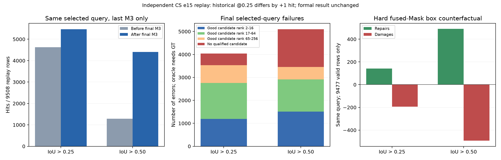

# CS第15轮best：完整验证独立复核诊断

**正式复现验收尚未通过。** batch12复核的9508条结果为5467/4409，checkpoint存档为5466/4409；@0.25多1个、@0.50一致。原断言未放宽，退出码1。正式best仍为57.4884%/46.3715%，本次差异不计作收益。结果写于2026-09-30T11:37:22+08:00，退出标记写于2026-09-30T11:37:29+08:00。

本目录压缩归档保留全部原始逐行数据；解压字节SHA **a3b12d806e4820af1e0f5129feabe8845618b8658b75020f67a16c805b944b5a**。本分析重算逐行命中、修复/破坏、错误分组及几何反事实，均与GPU输出摘要一致。checkpoint SHA **fad0cbe37e460cee038504948bb86dfda00b4e2ab402761692cd570908c00100**，无优化更新。历史逐行输出未保存，所以不能仅凭总命中差识别是哪条表达改变，更不能将最接近0.25的当前样本直接认定为历史差异样本。

| 最后一次M3，同一已选Query，9508条 | 精修前 | 精修后 | 修复/破坏 | 净变化 |
|---|---:|---:|---:|---:|
| @0.25 | 4623 | 5467 | 885/41 | +844 |
| @0.50 | 1283 | 4409 | 3147/21 | +3126 |

这是共同训练后的内部中间框对最终框的比较；前框已可能受到前一层M3影响，不是native模型，也不是整个M3的独立训练消融。不能将3126写成相对baseline新增命中。它反驳了“当前验证中最后M3主要修坏框”的假设。

| 精修后候选与实际选择 | @0.25 | @0.50 |
|---|---:|---:|
| 实际已选Query | 5467 | 4409 |
| 全256框GT几何上界 | 8995 | 7864 |
| 有合格框但没选中的错误 | 3528/4041＝87.30% | 3455/5099＝67.76% |
| 全256仍缺合格框的错误 | 513 | 1644 |

候选上界只用于离线GT诊断，不可部署；它还不能完全区分选错物体与同实例边界较差。当前结构中的几何证据回读与原生候选判别值得优先验证。

| 同一Query，融合Mask零logit真实点AABB反事实，仅9477条有效 | 原生最终框命中 | 硬融合Mask框命中 | 修复/破坏 | 净变化 |
|---|---:|---:|---:|---:|
| @0.25 | 5463 | 5410 | 141/194 | −53 |
| @0.50 | 4406 | 4403 | 490/493 | −3 |

31条没有有效硬Mask框，不用原框补齐。上表两边使用同一有效子集，不能与9508条准确率直接相减。旧V99固定所选Query后的+379没有在当前CS直接换框反事实中复现；这不能证明可学习的融合支撑没有价值，但不足以优先将所有最终框换成硬融合Mask框。

| GT体积组，仅离线分组 | 全组条数 | 有效融合框条数 | @0.25修复/破坏 | 净变化 | @0.50修复/破坏 | 净变化 |
|---|---:|---:|---:|---:|---:|---:|
| Q1 | 2377 | 2351 | 54/106 | -52 | 203/194 | +9 |
| Q2 | 2375 | 2372 | 45/20 | +25 | 150/138 | +12 |
| Q3 | 2379 | 2377 | 23/21 | +2 | 75/65 | +10 |
| Q4 | 2377 | 2377 | 19/47 | -28 | 62/96 | -34 |

体积分组使用本次GT体积四分位边界，相同体积保持同组，组大小不必相等；不是推理规则。超点中心上的M3概率质量位于GT框外的中位数为13.9473%，融合Mask为13.6543%；框外质量不等于真实实例背景率，且中位数不代表所有样本。最终Query与内部M3 logit的最大差中位数为0.007288，不能视为完全相同张量。

固定原batch重复前向已于2026-09-30 12:19:10 CST结束，见[数值稳定性探针](stability_analysis.md)。原M1成员聚合下相同输入的输出会变化；仅在探针中改用现有确定性聚合后，该批次三次输出逐元素完全一致。这不证明全部历史差异的唯一来源，也不改变正式best。结构方面优先真实GPU预检已有R回读草稿，保留现有几何计算和单一语义输出；暂不同时加入质量目标、G、教师或融合尾部。后续训练启动仍要满足实际容量、梯度及磁盘保存条件。当前数据不是未训练R或未来融合尾部的成绩。
